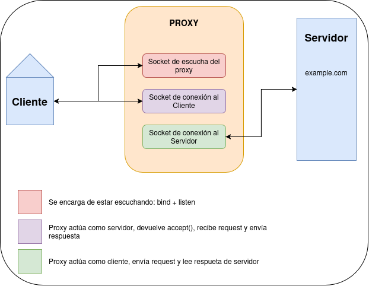

# Informe Actividad 1: Proxy
Link a github: https://github.com/ACGrt/actividad-1-proxy



## Cómo se probó el código

Usando una VM con Kali Linux se ejecutó:

```bash
python server.py config.json
```

Y se probó accediendo a los siguientes dominios mediante Firefox configurado para usar el proxy del script:

- http://cc4303.bachmann.cl/
- http://cc4303.bachmann.cl/replace
- http://cc4303.bachmann.cl/secret

## Decisiones y respuesta a preguntas

### 1. ¿Cómo sé si llegó el mensaje completo?

**R:** Usamos el delimitador de header que asume HTTP, `\r\n\r\n` para el head, y el contador `Content-Length` para el body. Si no llega así, es error de quien envía el mensaje.

**Decisiones:** Inicialmente, como no estaba implementado aún el poder recibir mensajes con un buffer menor a su tamaño, no había considerado usar `Content-Length` para el body. Cuando lo implementé y agregué la "censura" de palabras, no consideré que eso cambiaría el largo del contenido y cometí el error de modificar el header también. Asumo que es un error hacer que el header también se censure, ya que podría romper la petición.

### 2. ¿Qué pasa si los headers no caben en mi buffer?

**R:** No pasa nada, porque la decisión no se toma sobre lo que devuelve un `recv()` individual, sino sobre un buffer acumulado. `receive_full_header` concatena cada lectura en `full_message` y evalúa la condición de término sobre ese acumulado:

```python
while end_sequence not in full_message:
    recv_message = connection_socket.recv(buff_size)
    if not recv_message:
        break
    full_message += recv_message
```

Esto es lo que permite que funcione con `buff_size = 10`: el delimitador `\r\n\r\n` puede quedar partido entre dos lecturas (por ejemplo `\r\n` al final de una y `\r\n` al inicio de la siguiente) y aun así se detecta, porque para cuando se busca ya están concatenados.

### 3. ¿Cómo sé que el HEAD llegó completo?

**R:** Cuando se lee `\r\n\r\n`. Asumo la convención del protocolo HTTP, por lo que si no aparece es error de quien envíe el mensaje.

**Decisiones:** Mientras programaba esto me daba un error donde `receive_full_header` devolvía `!DOC` luego de los headers y se quedaba en loop (debug con prints). Esto era porque estaba usando un `buff_size` de 10 para un mensaje no divisible por 10, por lo que en la última iteración `recv` tomaba parte del body. Mi solución fue separar las funciones para obtener los headers y el body, y hacer que `receive_full_header` devuelva el body "infiltrado" para componerlo luego:

```python
cut = full_message.find(end_sequence) + len(end_sequence)
headers = full_message[:cut]
body_infiltrado = full_message[cut:]
return headers, body_infiltrado
```

### 4. ¿Cómo sé que el BODY llegó completo?

**R:** Usando el `Content-Length` que devuelve el servidor, iteramos `recv` hasta alcanzar exactamente el largo indicado. Para devolver el mensaje al cliente, recalculamos `Content-Length` luego de filtrar las palabras (si es que hay) para que no haya errores.

**Decisiones:** Dado que se separan las funciones para obtener el body y el header (y este último devuelve parte del body), `receive_full_body` comienza a contar los bytes recibidos que se infiltraron en `receive_full_header`, para no romper el largo del mensaje:

```python
bytes_received = len(body_infiltrado)
while bytes_received < content_length:
    ...
```

## Supuestos y limitaciones

Leyendo, entiendo que no es necesario que un servidor declare `Content-Length`, y mi código retornaría su valor como `0`, lo que implicaría un body vacío, es decir, una respuesta truncada. Pero no vi ninguna indicación al respecto, por lo que estoy asumiendo que estamos en el caso donde los servidores sí declaran `Content-Length`.

## Imagen de bloqueo

Respecto a la imagen de bloqueo, inicialmente la había colocado en base64. Sin embargo, se me explicó (auxiliar) cuál es la forma más acercada al mundo real de las páginas web. Con esto en mente, decidí hacer que la respuesta `403` no llevara la imagen, sino un `` que gatilla una segunda petición independiente que el proxy intercepta y resuelve de forma local.
